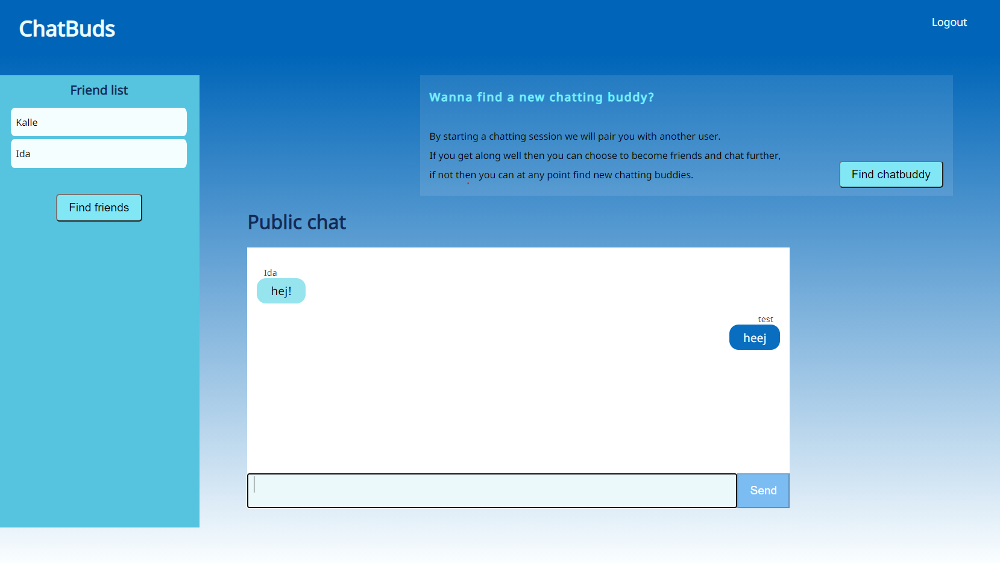
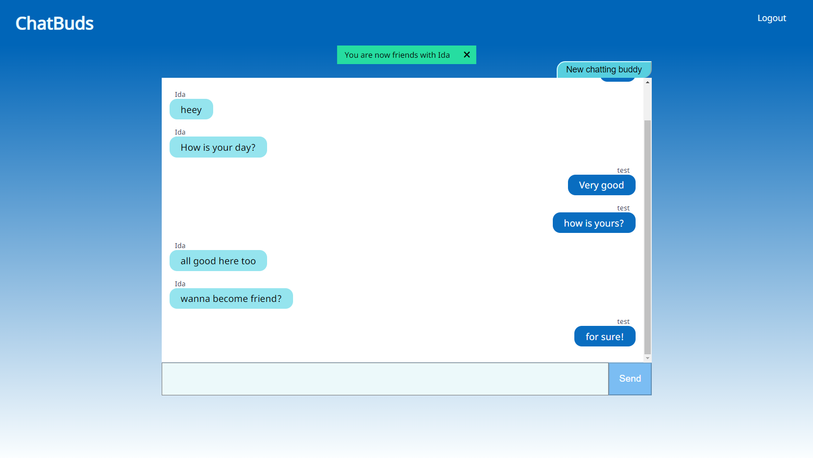

# Chatbuds

The client for the ChatBuds application.

## System overview
ChatBuds is built as a small microservice-architecture. The consumer/client only communicates with the API Gateway which handles the back-end communication.

The API Gateway: https://github.com/irosvall/chatbuds-api-gateway

The Authentication Service: https://github.com/irosvall/chatbuds-auth-service

The Resource Service: https://github.com/irosvall/chatbuds-resource-service

*Overview of the architecture*

## Samples

*Start page when logged in*

*Chat for finding a chatbuddy*

## Commands
The project was generated with [Angular CLI](https://github.com/angular/angular-cli) version 11.2.6.

### Running application on development server

Run `ng serve` for a dev server. Navigate to `http://localhost:4200/`. The app will automatically reload if you change any of the source files.

### Building ChatBuds

Run `ng build` to build the project. The build artifacts will be stored in the `dist/` directory. Use the `--prod` flag for a production build.

### Running unit tests

Run `ng test` to execute the unit tests via [Karma](https://karma-runner.github.io).

### Linting the code
Run `ng lint` to check for linting problems.
